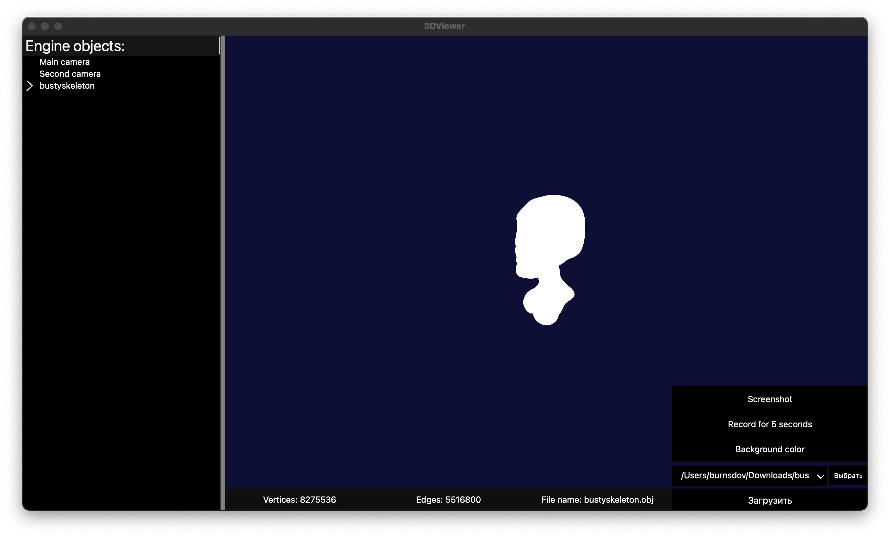

# 3D_Viewer 
Implementation of our own version of the 3D Viewer.

<br>
## Build
### Preparation
   To start build you need to move to `./src` dir.
   ```Bash
   cd ./src
   ```
### Build
* Build program

   ```
   make all
   ```
   or
   ```
   make install
   ```
*  Build and run tests
   ```
   make tests
   ```
*  Generate lib code coverage by tests into `./src/report` dir
   ```
   make gcov_report
   ```
*  Clean project
   ```
   make clean
   ```
*  Unistall Project
   ```
   make uninstall
   ```
*  Open HTML file
   ```
   make dvi
   ```
*  Create archive with program
   ```
   make dist
   ```

## Opportunities

### Camera

| Camera        | Object  | Object.Transform | Object.Mesh
--------------- | -------- | ----------------- | ----
| Position      | Type       |   Transformation | Standart buffer (not aviable)
| Orientation   | Color       |  Rotation | Wireframe buffer
| Focus point   | Line width      | Scale | Triangle buffer
| Camera mode   | Point type      |    | Vertex only buffer (not aviable)
| View mode     | Point size      |
| Plane offsets | Point color      |
| Parallel view box |      |
| FOV |    |


## Program structure
   [Diagram view site](https://www.figma.com/file/nGy4tPASGJtjk9WPn4Hvln/Untitled?type=whiteboard&node-id=0%3A1&t=a1sLc8c37jnA8Nz1-1)